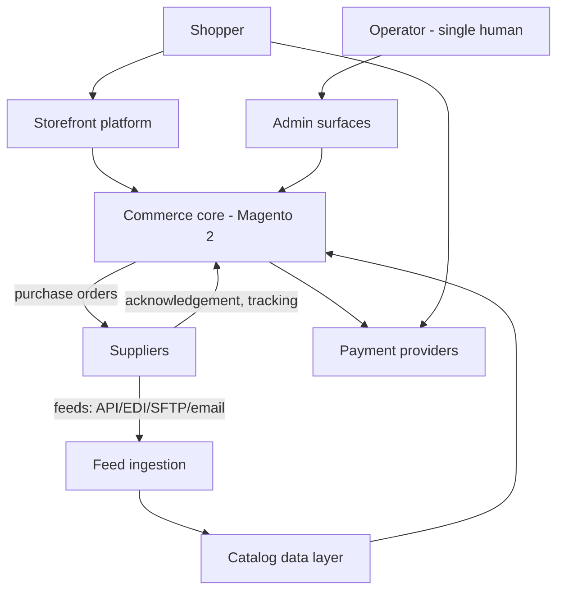

# C4 L1 - System context

## External actors
- Shopper - buys on one of the tenants.
- Operator - the single human; the goal is to remove him from the loop.
- Supplier - holds stock, receives purchase orders, ships to the shopper. Integration maturity varies per supplier; each gets an adapter behind one internal contract.
- Payment providers - OPEN: which PSPs, per market.
- Carriers - not integrated directly; tracking arrives from the supplier. TODO(human): confirm, or decide that carrier APIs are needed for delivery events.

## System boundary
Inside: storefront platform, Magento 2, catalog data layer, feed ingestion and supplier adapters, order routing/sourcing, event bus, supporting services.
Outside: supplier systems, payment providers, carriers, Cloudflare edge.

Explicitly not in this system: any pre-existing PIM or ERP (INV-06). Every capability those would have provided is built inside the boundary or explicitly deferred.
