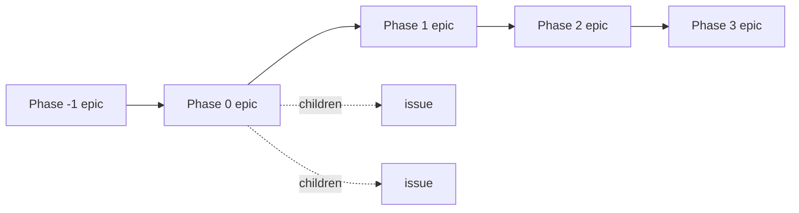

# Work queue - design

Design approved 2026-08-04, built 2026-08-05. ADR-0008 chose beads; this document says how it is used at scale.

Status on 2026-08-05, 37 open issues:

- **Built:** WQ-03 (37 open issues typed: 14 `task`, 12 `decision`, 6 `chore`, 5 `epic`), WQ-04 (5 epics and 24 children labelled), WQ-05 (5 phase epics, chained by `blocks`), and all four checks in `scripts/queue-check.py`, run on every push by `.github/workflows/docs-hygiene.yml`.
- **Built as a convention, zero instances:** WQ-08. It applies to issues created from now on; retrofitting provenance from memory would invent it.
- **Withdrawn:** WQ-06. `bd` 1.0.5 forbids the mechanism outright - see its entry below.
- **Deferred, nothing to do until a second repo exists:** WQ-01. Today there is one repo and the database is in it; `BEADS_DIR` is recorded so the first code repo does not silently `bd init` its own.
- **Deferred, blocked on `bd` issue docs-3nj:** WQ-02, the prefix rename, which rewrites every id in one operation and must not run on a sync path not yet shown to round-trip. WQ-09's one reopenable item, `bd repo` hydration, waits on the same issue.
- **Deferred, waiting on work not yet done:** WQ-07. There is nothing to distil until Phase 1 has been built once by hand.
- **Known gap:** WQ-C3 does not cover the `decision` type - see the Checks section and `docs-a5t`.

## Why this exists

Measured on 2026-08-04, `bd` 1.0.5, 31 open issues:

- `bd ready` returns **21 of 31**. The queue does not narrow. Two thirds of the database is nominally startable.
- Priority no longer discriminates: **P0=7, P1=16, P2=7, P3=1**. Half the database sits in one bucket.
- **31 of 31** issues are type `task`, including issues whose whole content is a decision.
- **Zero** labels exist.
- All 31 id suffixes are 3 characters; beads lengthens suffixes as the database grows, so ids will not stay uniform.

The corpus will span infra, frontend, backend, catalog, feeds and sourcing (`10-architecture/c4-container.md` already names the repos) and is expected to reach hundreds of issues. At that size the failure above is not cosmetic: a `bd ready` that returns 200 items is the ordered list beads replaced, wearing a different shape.

**The constraint this design follows: readiness is computed from `blocks` and `parent_id` only. Labels, priority, type and every non-blocking link leave the ready frontier untouched.** Therefore the queue is narrowed by the phase graph, and labels exist only to slice a view.

## Decisions

### WQ-01 One database for the whole project
- One beads database serves all layers. Code repos reach it through `BEADS_DIR` rather than owning a database each.
- Rationale: cross-layer dependencies (feed adapter -> backend contract -> storefront) stay ordinary `bd dep` edges. Splitting per repo makes the one relationship the tool was chosen for the one relationship it cannot express directly.
- Rejected: `bd federation`, which multiplies a sync path that is not yet proven to round-trip (`bd` issue docs-3nj).

### WQ-02 The prefix names the project, not a layer
- The current prefix is `docs`, which is already wrong for an issue about returns policy and will be wrong for every infra issue.
- Rename to a neutral prefix once, as early as possible. A prefix is permanent per issue and cannot be changed per issue afterwards.
- **Blocked by `bd` issue docs-3nj.** The rename rewrites every id in one operation; doing that on a sync path not yet shown to reach a second clone risks a split database.
- Cost accepted at rename time: 38 references across 6 files are rewritable; 7 commit subjects in git history are not and will dangle permanently. That cost grows with every commit, which is why the rename is not deferred past docs-3nj.

### WQ-03 Kind of work is `issue_type`, never a label
- `bug`, `feature`, `epic`, `chore`, `decision`, `spike`, `milestone` are built in, filterable with `--type` / `--exclude-type`, and drive `bd lint` section requirements.
- Backfill: the 31 existing `task` issues are retyped. Issues whose content is a choice between options become `decision`.

### WQ-04 Layer is one flat label, carried by the epic
- Closed vocabulary, derived from `10-architecture/c4-container.md`, not invented here: `infrastructure`, `frontend`, `backend`, `catalog`, `feeds`, `sourcing`, `product`.
- `product` covers commercial, legal and market work - the majority of the current queue - which owns no container.
- The label is set on the epic. `bd create --parent` copies the epic's labels onto the child at creation; `--no-inherit-labels` opts out.
- **Measured 2026-08-05: inheritance saves no labour on this corpus.** The migration labelled all 24 children explicitly, and 7 of the 24 carry a layer different from their epic's - under Phase 0, all four do. Phase epics span layers, so inheritance seeds a label the child usually has to replace. The layer is in practice per-issue; the epic's label says what the epic is mostly about and nothing more. The mechanism is real and stated because it fires on every `bd create --parent`, but do not re-derive this decision from a labour saving it does not deliver here.
- Consequence of inheritance: an epic carries **only** its layer label. Any other label on an epic propagates to every child, including ones it does not describe.
- **`dimension:value` syntax is forbidden for this axis.** That form belongs to `bd set-state` / `bd state`, which write an event bead on every change and model operational state. A layer does not change over time and must not carry that machinery.
- This is the only label axis. Upstream guidance is 5-10 technical labels; seven values spend that budget. A second axis requires retiring this one.
- Both of those rules - one layer label on an epic, one axis overall - are **mechanism, not judgement**. WQ-C1 rejects any label outside the seven-value vocabulary on any open issue, so a second axis cannot be opened without the check naming it.

### WQ-05 Phases are epics; roadmap.md and the graph do not overlap
- One epic per roadmap phase. `bd dep add <phase N+1> <phase N> --type blocks` orders them.
- An issue that belongs to a phase is created with `--parent <phase epic>`, which also delivers WQ-04 inheritance.
- **Division of ownership, so there are two documents and one fact, not two copies:**
  - `00-product/roadmap.md` owns what a phase means, its deliverables, its exit gate in prose, and its course-change thresholds. It names no issues.
  - The phase epic owns which issues are in the phase and what blocks what. It carries no prose.
  - The only shared fact is the name and order of the phases. That is what WQ-C2 checks.
- This replaces the current unverifiable pointer in roadmap.md, Phase -1: *"All three are open beads issues"* names no ids, so a fourth issue would join silently.
**Measured after implementation, 2026-08-05: `bd ready` went from 21 to 22. The phase graph narrowed nothing.** The prediction that motivated this design was wrong on today's corpus, and the reason is not a defect in the graph. Twenty of the twenty-four phase-owned issues belong to Phase -1, the current phase, which nothing blocks by construction. The four Phase 0 issues that the graph does newly block were already blocked by ordinary `blocks` edges onto open Phase -1 work, so the phase layer is redundant with what was already there. The `+1` is the Phase -1 epic itself, which is ready and correctly so. Verified with `bd dep tree` on all four, independently of the run that made the change.

The honest reading: 21-of-31 was never evidence of a missing structure. It is what a corpus looks like when almost all of its work sits in one phase and is genuinely parallel. The graph starts paying at the first phase transition, when Phase 0 issues outnumber their organic blockers — which is the state this design was built for and is not the state today. Anyone re-deriving this decision should weigh it on that basis, not on a narrowing that has not happened.

- Issues outside every phase (repo hygiene, tooling) take no parent and stay permanently ready. That is correct, and it means the ready set floors above zero rather than reaching it.
- Such issues also carry no layer label, since WQ-04 attaches the label to an epic. That is the intended reading, not an omission: work that belongs to no container has no layer to name. WQ-C1 therefore scopes its one-label rule to issues that have a parent, plus every epic - an epic has no parent but carries the label its children inherit. WQ-C1's vocabulary rule applies to every open issue regardless.

### WQ-06 Exit gates are gate issues — WITHDRAWN 2026-08-05
- Not implementable in `bd` 1.0.5, and not needed. Both established by attempting it.
- The tool refuses: `bd dep add <phase epic> <gate> --type blocks` returns `Error: epics can only block other epics, not tasks`. A gate is typed `gate`, a phase is typed `epic`, so no gate can block a phase. `bd gate create --blocks <epic>` fails the same way.
- Also observed: a gate's title is `Gate: <type>`, never derived from `--reason`, so the exit-gate wording would not have been visible on the gate at all.
- Withdrawn rather than worked around, because the epic-to-epic chain in WQ-05 already does the job: the next phase opens when the previous phase epic is closed, and closing it is the human confirmation a gate would have asked for. A gate would add a second object requiring a second manual act for the same decision.
- What is lost: nothing mechanical. What a gate would have added over closing the epic is an explicit record that the exit criteria were reviewed. That record lives in the phase epic's own `Success Criteria` and in `00-product/roadmap.md`.

### WQ-07 Repeated work becomes a formula, after it has been done once
- Phase 2 and Phase 3 instantiate the same work graph per tenant and per supplier.
- Path: build it by hand in Phase 1, then `bd mol distill <epic-id> <formula-name>`, then `bd mol pour <formula> --var slug=<tenant>` per instance.
- Writing a formula before the first instance exists templates a guess. `.beads/formulas/` stays empty until then.

### WQ-08 Discovery keeps its provenance
- Issues found while doing other work are created with `--deps discovered-from:<id>`.
- This is a non-blocking link: it records where the finding came from without adding a blocker.

### WQ-09 Out of scope
- Multi-agent orchestration - swarms, personas, merge slots, agent routing. The beads charter places "agent routing, task assignment strategy, model choice, retry plans, scheduling" outside the tool; this project has one operator and gains nothing.
- Tracker integrations (jira, linear, notion, ado) - ADR-0008 removed the tracker they would bridge to.
- `metadata` JSON - an extension point for integrations, and this design needs no field that a label or a type does not already carry.
- `bd repo` multi-repo hydration - the one mechanism that could revisit WQ-01. Evaluate after docs-3nj, not before.

## Checks

A rule stated here without an instrument is an obligation verified at review, and this repo has measured what that produces (`40-devops/drift-audit-spec.md`). Each check below ships in the same commit as the rule it enforces, with the violation that makes it fail.

| id | Check | Injected violation that must make it exit non-zero |
|---|---|---|
| WQ-C1 | Every open epic, and every open issue that has a parent, carries exactly one WQ-04 label; no open issue carries a label outside the seven-value vocabulary | Add a second layer label to one issue; remove the label from one epic; add a label outside the vocabulary to one issue |
| WQ-C2 | Phase headings in `00-product/roadmap.md` and phase epics agree on count and name | Add a phase heading to roadmap.md with no matching epic; rename one epic |
| WQ-C3 | Every open issue carries the sections its type requires, each opening a line | Create an issue of type `task` with no Acceptance Criteria; and one whose description only mentions the phrase in prose |
| WQ-C4 | No issue id appears in a commit subject while still open — **warning, not error** | Reference an open issue id in a commit subject and leave it open; the run must warn and still exit 0 |

- All four read `.beads/issues.jsonl` and `git log`. Neither invokes `bd`.
- WQ-C4 warns rather than fails, decided 2026-08-05 on a case in this repo's own history. `d4704f2` names `docs-b83` in its subject because it *recorded* that issue, not because it did its work, and the work is still legitimately open. The check cannot separate the two intents, so as an error it would be permanently red — the failure mode `scripts/docs-check.py` already names, where a check that is always failing teaches the reader to skip it. Every other rule here is an error.
- Reason, corrected 2026-08-04 during planning: `.github/workflows/docs-hygiene.yml` installs Python only. A check that shells out to `bd` either breaks CI or is skipped when the binary is absent, and a skipped check is a green tick with nothing behind it. The export file is tracked in git (`export.auto`, `export.git-add` in `.beads/config.yaml`), so the queue's state is readable as a file wherever the repo is checked out.
- WQ-C3 covers four types and restates their `bd lint` requirements rather than calling it: `task` and `feature` need `Acceptance Criteria`, `bug` needs `Steps to Reproduce` and `Acceptance Criteria`, `epic` needs `Success Criteria`. The duplication is deliberate and bounded: four lines.
- **WQ-C3 does not cover `decision`, and that is the queue's largest unchecked surface.** Measured 2026-08-05: `bd lint` reports 12 issues / 32 warnings, every one of type `decision`, wanting `## Decision`, `## Rationale`, `## Alternatives Considered`. `REQUIRED_SECTIONS` in `scripts/queue-check.py` has no `decision` key, so WQ-C3 reports zero for all 12 - and WQ-03's retyping is what moved them out of its reach. The key is not added ahead of the backfill because that alone would put CI at 36 errors on the next push; both halves land in one commit, tracked as `docs-a5t`.
- They live in `scripts/queue-check.py`, not in `scripts/docs-check.py`, which owns document hygiene and takes no argument about issues.
- The export lags the database. `bd update` writes Dolt; the checks read `.beads/issues.jsonl`, refreshed on a 60s `export.interval`. Measured 2026-08-05: a check run immediately after a batch of updates reported 13 errors that no longer existed. Any local run therefore does `bd export -o .beads/issues.jsonl` first; CI is unaffected, since it reads the committed file. A missing export file is a hard failure, not an empty queue: returning zero issues let a mistyped `--root` print `checked 0 issues / ok` and exit 0.
- WQ-C4 already works today with no new convention: `CONVENTIONS.md` session close requires the issue id in the commit subject.
- Registering these does not create an eighth drift-audit pair. WQ-C2 compares one line per phase, not two descriptions of the same phase; the prose lives in exactly one place by WQ-05.

## Evidence status

Verified locally against `bd` 1.0.5 (Homebrew) on 2026-08-04, by running the command:

- label inheritance from parent, and its opt-out - `bd create --help` (`--no-inherit-labels`)
- `dimension:value` is owned by state machinery - `bd set-state --help`, `bd state --help`
- `bd lint` section requirements per type - `bd lint --help`
- `bd orphans` reads commit subjects - `bd orphans --help`
- `--deps discovered-from:<id>` - `bd create --help`
- multi-repo hydration exists as `bd repo` - `bd repo --help`
- the five measurements under "Why this exists" - `bd list --json`
- no hardcoded issue-id length exists in `scripts/` or `.github/`, so growing id suffixes break nothing here

Verified by probe on 2026-08-04 - two throwaway issues created, inspected and deleted, database confirmed back at 33 records:

- a child created with `--parent` inherits the parent's labels, unasked. Confirmed on the export, not on the help text.
- a child's id is hierarchical: parent `docs-2ob` produced child `docs-2ob.1`.
- the parent link is exported explicitly as a dependency of `"type": "parent-child"`. WQ-C1 reads that, not the dot in the id.
- `labels` appears in the export only when an issue has labels; absent means none, not an omission.
- there is no `parent`/`parent_id` field in the export at all.

Claims about upstream documentation, cited rather than tested. All read 2026-08-04, all under `https://github.com/gastownhall/beads/blob/main/`:

- readiness is computed from `blocks` and `parent_id` only - docs/core-concepts/graph-links.md
- label budget of 5-10 technical labels, and the inheritance caveat - docs/core-concepts/labels.md
- id suffix length grows with database size - docs/core-concepts/adaptive-ids.md
- a prefix is permanent and prefix-based isolation is "too fragile" - engdocs/CONTRIBUTOR_NAMESPACE_ISOLATION.md
- orchestration is out of scope for beads - engdocs/PROJECT_CHARTER.md
- gate semantics and `--type=human` - docs/workflows/gates.md
- distill / pour / `--var` - docs/workflows/molecules.md
- phases as epics plus blocking dependencies - examples/multi-phase-development/README.md

## Open

- OPEN: the neutral prefix string for WQ-02. Blocked by docs-3nj.
- OPEN: whether `bd repo` hydration changes WQ-01. Evaluate after docs-3nj.
- OPEN: which phase owns an issue that spans two phases. Current rule is the earliest phase that cannot finish without it; untested against a real case.